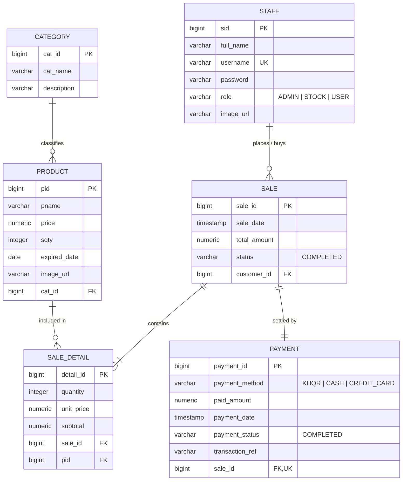

# Database Schema & Entity Relationships

## 🗄️ Database: PostgreSQL 18

---

## Table Definitions

### 1. `staff` (Staff & Customer Accounts)
| Column | Type | Constraints | Description |
|---|---|---|---|
| `sid` | `BIGINT` | `PRIMARY KEY`, `AUTO_INCREMENT` | Unique staff/user identifier |
| `full_name` | `VARCHAR(255)` | | Display name of user |
| `username` | `VARCHAR(255)` | `NOT NULL`, `UNIQUE` | Login username |
| `password` | `VARCHAR(255)` | `NOT NULL` | User password |
| `role` | `VARCHAR(50)` | `NOT NULL` | `ADMIN`, `STOCK`, or `USER` |
| `image_url` | `VARCHAR(255)` | | Avatar image path or web URL |

### 2. `category` (Snack Categories)
| Column | Type | Constraints | Description |
|---|---|---|---|
| `cat_id` | `BIGINT` | `PRIMARY KEY`, `AUTO_INCREMENT` | Category ID |
| `cat_name` | `VARCHAR(255)` | `NOT NULL` | Category title (e.g. *Chips & Crisps*) |
| `description` | `VARCHAR(500)` | | Category description |

### 3. `product` (Inventory Items)
| Column | Type | Constraints | Description |
|---|---|---|---|
| `pid` | `BIGINT` | `PRIMARY KEY`, `AUTO_INCREMENT` | Product ID |
| `pname` | `VARCHAR(255)` | `NOT NULL` | Snack product title |
| `price` | `NUMERIC(10,2)` | `NOT NULL` | Unit retail price ($ USD) |
| `sqty` | `INTEGER` | `NOT NULL` | Current in-stock quantity |
| `expired_date` | `DATE` | `NOT NULL` | Shelf-life expiration date |
| `image_url` | `VARCHAR(255)` | | Image path (e.g. `/images/...` or `/uploads/...`) |
| `cat_id` | `BIGINT` | `FOREIGN KEY` references `category(cat_id)` | Category relation |

### 4. `sale` (Sales / Orders)
| Column | Type | Constraints | Description |
|---|---|---|---|
| `sale_id` | `BIGINT` | `PRIMARY KEY`, `AUTO_INCREMENT` | Order / Sale ID |
| `sale_date` | `TIMESTAMP` | `NOT NULL` | Order placement timestamp |
| `total_amount` | `NUMERIC(10,2)` | `NOT NULL` | Total order transaction amount ($ USD) |
| `status` | `VARCHAR(50)` | `NOT NULL` | Order lifecycle state (`COMPLETED`) |
| `customer_id` | `BIGINT` | `FOREIGN KEY` references `staff(sid)` | Buyer account relation |

### 5. `sale_detail` (Order Line Items)
| Column | Type | Constraints | Description |
|---|---|---|---|
| `detail_id` | `BIGINT` | `PRIMARY KEY`, `AUTO_INCREMENT` | Line item identifier |
| `quantity` | `INTEGER` | `NOT NULL` | Units purchased |
| `unit_price` | `NUMERIC(10,2)` | `NOT NULL` | Unit price at time of sale |
| `subtotal` | `NUMERIC(10,2)` | `NOT NULL` | Line total (`quantity * unit_price`) |
| `sale_id` | `BIGINT` | `FOREIGN KEY` references `sale(sale_id)` | Parent order relation |
| `pid` | `BIGINT` | `FOREIGN KEY` references `product(pid)` | Purchased product relation |

### 6. `payment` (Settlements & Invoices)
| Column | Type | Constraints | Description |
|---|---|---|---|
| `payment_id` | `BIGINT` | `PRIMARY KEY`, `AUTO_INCREMENT` | Settlement receipt identifier |
| `payment_method` | `VARCHAR(50)` | `NOT NULL` | `KHQR`, `CASH`, `CREDIT_CARD` |
| `paid_amount` | `NUMERIC(10,2)` | `NOT NULL` | Total settled amount ($ USD) |
| `payment_date` | `TIMESTAMP` | `NOT NULL` | Payment transaction timestamp |
| `payment_status` | `VARCHAR(50)` | `NOT NULL` | Settlement status (`COMPLETED`) |
| `transaction_ref` | `VARCHAR(255)` | `NOT NULL` | Unique transaction audit code (e.g. `TXN-...`) |
| `sale_id` | `BIGINT` | `FOREIGN KEY`, `UNIQUE` references `sale(sale_id)` | 1-to-1 Sale relation |
