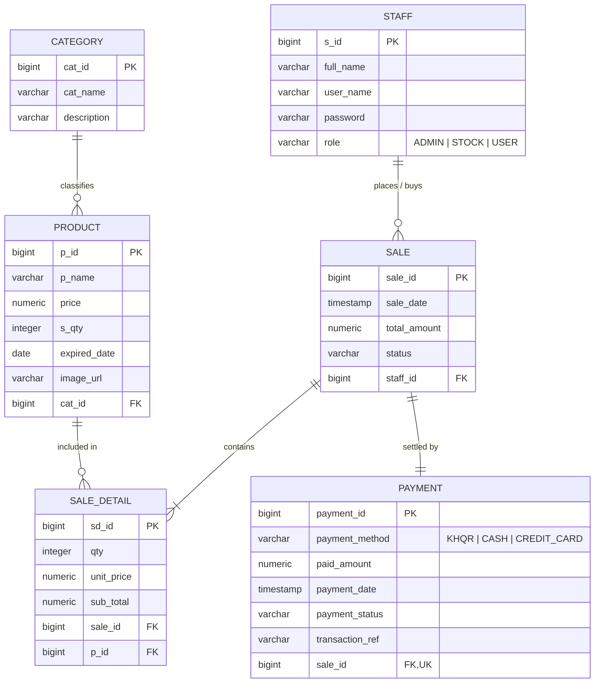

# Database Schema & Entity Relationships

## 🗄️ Database: PostgreSQL 18

---

## Table Definitions

### 1. `staff` (Staff & Users)
| Column | Type | Constraints | Description |
|---|---|---|---|
| `s_id` | `BIGINT` | `PRIMARY KEY`, `AUTO_INCREMENT` | Unique staff identifier |
| `full_name` | `VARCHAR(255)` | `NOT NULL` | Display name of user |
| `user_name` | `VARCHAR(255)` | `NOT NULL`, `UNIQUE` | Login username |
| `password` | `VARCHAR(255)` | `NOT NULL` | User password |
| `role` | `VARCHAR(50)` | `NOT NULL` | `ADMIN`, `STOCK`, or `USER` |

### 2. `category` (Product Categories)
| Column | Type | Constraints | Description |
|---|---|---|---|
| `cat_id` | `BIGINT` | `PRIMARY KEY`, `AUTO_INCREMENT` | Category ID |
| `cat_name` | `VARCHAR(255)` | `NOT NULL` | Category name (e.g. *Chips & Crisps*) |
| `description` | `VARCHAR(500)` | | Category description |

### 3. `product` (Inventory Items)
| Column | Type | Constraints | Description |
|---|---|---|---|
| `p_id` | `BIGINT` | `PRIMARY KEY`, `AUTO_INCREMENT` | Product ID |
| `p_name` | `VARCHAR(255)` | `NOT NULL` | Product title |
| `price` | `NUMERIC(10,2)` | `NOT NULL` | Unit retail price ($ USD) |
| `s_qty` | `INTEGER` | `NOT NULL` | Current in-stock quantity |
| `expired_date` | `DATE` | `NOT NULL` | Shelf-life expiration date |
| `image_url` | `VARCHAR(255)` | | Image path (e.g. `/images/...` or `/uploads/...`) |
| `cat_id` | `BIGINT` | `FOREIGN KEY` references `category(cat_id)` | Category relation |

### 4. `sale` (Sales / Orders)
| Column | Type | Constraints | Description |
|---|---|---|---|
| `sale_id` | `BIGINT` | `PRIMARY KEY`, `AUTO_INCREMENT` | Order / Sale ID |
| `sale_date` | `TIMESTAMP` | `NOT NULL` | Order timestamp |
| `total_amount` | `NUMERIC(10,2)` | `NOT NULL` | Total order value |
| `status` | `VARCHAR(50)` | `NOT NULL` | Order state (`COMPLETED`) |
| `staff_id` | `BIGINT` | `FOREIGN KEY` references `staff(s_id)` | Buyer / Staff account |

### 5. `sale_detail` (Order Line Items)
| Column | Type | Constraints | Description |
|---|---|---|---|
| `sd_id` | `BIGINT` | `PRIMARY KEY`, `AUTO_INCREMENT` | Line item ID |
| `qty` | `INTEGER` | `NOT NULL` | Quantity purchased |
| `unit_price` | `NUMERIC(10,2)` | `NOT NULL` | Item price at time of sale |
| `sub_total` | `NUMERIC(10,2)` | `NOT NULL` | `qty * unit_price` |
| `sale_id` | `BIGINT` | `FOREIGN KEY` references `sale(sale_id)` | Parent sale |
| `p_id` | `BIGINT` | `FOREIGN KEY` references `product(p_id)` | Purchased product |

### 6. `payment` (Settlements)
| Column | Type | Constraints | Description |
|---|---|---|---|
| `payment_id` | `BIGINT` | `PRIMARY KEY`, `AUTO_INCREMENT` | Payment receipt ID |
| `payment_method` | `VARCHAR(50)` | `NOT NULL` | `KHQR`, `CASH`, `CREDIT_CARD` |
| `paid_amount` | `NUMERIC(10,2)` | `NOT NULL` | Total settled amount |
| `payment_date` | `TIMESTAMP` | `NOT NULL` | Settlement timestamp |
| `payment_status` | `VARCHAR(50)` | `NOT NULL` | `COMPLETED` |
| `transaction_ref` | `VARCHAR(255)` | | Bank / Gateway transaction ref |
| `sale_id` | `BIGINT` | `FOREIGN KEY`, `UNIQUE` references `sale(sale_id)` | 1-to-1 Sale relation |
