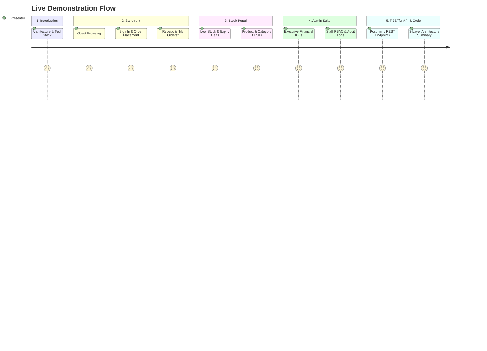

# 🎙️ Project Presentation Script & Comprehensive Architectural Guide

> **Project Name**: Authentic American Snacks E-Commerce & Inventory Management Suite  
> **Course / Context**: Spring Boot Midterm Project (Full 3-Layer MVC & RESTful Architecture)  
> **Repository**: `https://github.com/Mongkol7/Ecom_SpringBoot_SV2.6.git`

---

## 🛠️ 1. Technologies & Tools Used in This Project

| Layer / Aspect | Technology / Library | Purpose & Implementation Details |
| :--- | :--- | :--- |
| **Language & Platform** | **Java 21 (LTS)** | Modern Java features (Records, Pattern Matching, Stream API). |
| **Framework** | **Spring Boot 3.4.x / 4.1.0** | Auto-configuration, embedded Tomcat server, standalone execution. |
| **Web & MVC Layer** | **`spring-boot-starter-web`** | Handles HTTP requests, `@Controller` view routing, and `@RestController` JSON APIs. |
| **Template Engine** | **`spring-boot-starter-thymeleaf`** | Server-side rendering (SSR), dynamic data binding (`th:text`, `th:each`, `th:if`, `th:object`). |
| **Persistence & ORM** | **`spring-boot-starter-data-jpa` (Hibernate)** | Object-Relational Mapping, entity lifecycle management, JPQL queries. |
| **Database Engine** | **PostgreSQL 18** | Relational DB storage, ACID transactions, relational foreign keys. |
| **Security & RBAC** | **Custom Spring `HandlerInterceptor` + `HttpSession`** | Role-Based Access Control (`ADMIN`, `STOCK`, `USER`), zero overhead session management. |
| **UI & Styling** | **Tailwind CSS + Glassmorphism + Pure CSS** | Responsive modern UI, Plus Jakarta Sans typography, Material Symbols icons. |
| **Zero-JS Modals** | **Pure CSS `:target` Pseudo-class** | Centered confirmation dialogs for deletes and sign-outs without JavaScript dependencies. |
| **Build & Dependency Tool** | **Apache Maven (`mvnw`)** | Build automation, dependency resolution, and multi-environment packaging. |

---

## 📂 2. Project Directory & File Summary

```text
SpringBoot_MidTerm/
├── pom.xml                                   # Project Maven configuration & dependencies
├── src/
│   ├── main/
│   │   ├── java/com/example/springboot_midterm/
│   │   │   ├── SpringBootMidTermApplication.java  # Main Spring Boot Application entry point
│   │   │   │
│   │   │   ├── config/                       # Application configuration & system lifecycle beans
│   │   │   │   ├── AuthInterceptor.java      # RBAC Interceptor protecting Admin, Stock, and User routes
│   │   │   │   ├── WebConfig.java            # Registers interceptors & static asset exclusions
│   │   │   │   └── DataInitializer.java      # Seeds default accounts, 16 snacks, categories, and sales
│   │   │   │
│   │   │   ├── controller/                   # MVC View Controllers (Lesson 03, 05, 06)
│   │   │   │   ├── AuthController.java       # Root redirect (/), login, and session logout
│   │   │   │   ├── AdminController.java      # Executive dashboard, Staff CRUD, financial loss audits
│   │   │   │   ├── StockController.java      # Stock dashboard, Product/Category CRUD, inventory restock
│   │   │   │   ├── UserController.java       # Storefront views (Shop, Catalog, Cart, Wishlist, Orders)
│   │   │   │   │
│   │   │   │   └── api/                      # RESTful Web Services (Lesson 08)
│   │   │   │       ├── ProductRestController.java   # Full REST CRUD (/api/products)
│   │   │   │       ├── CategoryRestController.java  # Full REST CRUD (/api/categories)
│   │   │   │       ├── StaffRestController.java     # Full REST CRUD (/api/staff)
│   │   │   │       └── StoreRestController.java     # Asynchronous Cart & Wishlist API (/shop/api)
│   │   │   │
│   │   │   ├── model/                        # JPA Entity Classes (Lesson 12)
│   │   │   │   ├── Category.java             # Product category classification entity
│   │   │   │   ├── Product.java              # Snack product entity (with price, stock, expiry date)
│   │   │   │   ├── Staff.java                # User/Staff account entity with RBAC roles
│   │   │   │   ├── Sale.java                 # Customer purchase order header
│   │   │   │   ├── SaleDetail.java           # Line items linking individual products to a sale
│   │   │   │   └── Payment.java              # Transaction settlement record (KHQR, Cash, Card)
│   │   │   │
│   │   │   ├── repository/                   # Spring Data JPA Repositories (Lesson 10 & 12)
│   │   │   │   ├── CategoryRepository.java   # Category DB operations & name lookup
│   │   │   │   ├── ProductRepository.java    # Product queries (available, low stock, expired, search)
│   │   │   │   ├── StaffRepository.java      # User lookup by username and role
│   │   │   │   ├── SaleRepository.java       # Sale orders, customer order history, total revenue
│   │   │   │   ├── SaleDetailRepository.java # Top-selling category & product aggregations
│   │   │   │   └── PaymentRepository.java    # Payment ledger & payment method breakdown
│   │   │   │
│   │   │   ├── service/                      # Business Logic Layer (Lesson 10 & 11)
│   │   │   │   ├── CategoryService.java      # Category management logic
│   │   │   │   ├── ProductService.java       # Stock calculation, inventory valuation, expiry audits
│   │   │   │   ├── StaffService.java         # Authentication & staff directory operations
│   │   │   │   ├── SaleService.java          # Order checkout, stock deduction, sale detail creation
│   │   │   │   └── PaymentService.java       # Transaction reference generation & payment records
│   │   │   │
│   │   │   └── exception/                    # Global Exception Handling
│   │   │       ├── GlobalExceptionHandler.java       # @ControllerAdvice returning user-friendly error views
│   │   │       ├── ResourceNotFoundException.java   # Thrown when entity is missing (404)
│   │   │       ├── InsufficientStockException.java  # Thrown when stock is inadequate or expired (400)
│   │   │       ├── UnauthorizedAccessException.java # Thrown when access is forbidden (403)
│   │   │       └── ErrorResponse.java               # Structured error response model
│   │   │
│   │   └── resources/
│   │       ├── application.properties        # Port 3000, PostgreSQL URL, ddl-auto=update, show-sql
│   │       ├── static/                       # Static CSS, JS, snack images, avatar uploads
│   │       └── templates/                    # Thymeleaf HTML Templates
│   │           ├── login.html                # Modern login view with demo account pills
│   │           ├── admin/                    # Admin portal views (dashboard, staff, history, reports)
│   │           ├── stock/                    # Stock portal views (dashboard, product-list, form, categories)
│   │           ├── user/                     # Storefront views (shop, catalog, cart, wishlist, orders, receipt)
│   │           └── error/                    # Error views (404.html, error.html)
│   │
└── docs/                                     # Documentation Hub
    ├── all_lesson.md                         # Syllabus & 12 Lesson principles
    ├── api_routes.md                         # Complete MVC & RESTful API routes reference
    ├── database_schema.md                    # Database ER diagram & PostgreSQL table schemas
    ├── memories.md                           # Core system constraints & business rules
    └── demo_presentation_guide.md            # This presentation script
```

---

## 🎬 3. Step-by-Step Live Demo Presentation Script

### 🕒 Total Presentation Duration: 8 to 10 Minutes



---

### 🎙️ Phase 1: Introduction & Architecture Overview (1.5 Mins)

> **What to Say:**
> *"Good morning/afternoon, teachers and classmates. Today, I am proud to present our Spring Boot Midterm Project — an **Authentic American Snacks E-Commerce and Enterprise Inventory Suite**.*
> 
> *Our application is built on **Java 21** and **Spring Boot**, running on port **3000** connected to **PostgreSQL 18**. It strictly adheres to the **3-Layer Architecture**: Controller Layer $\rightarrow$ Service Layer $\rightarrow$ Repository Layer $\rightarrow$ Database.*
> 
> *We implemented two complete paradigms: A full **Thymeleaf MVC UI** with responsive styling and zero-JavaScript confirmation modals, as well as a dedicated **RESTful API Layer** implementing full CRUD operations with standard HTTP methods and status codes according to our course curriculum."*

---

### 🎙️ Phase 2: Guest Browsing & Storefront Experience (2 Mins)

> **Action**: Open browser at `http://localhost:3000/`.

> **What to Say:**
> 1. *"When any visitor opens the application, our default route intelligently guides them to the **Storefront Landing Page** at `/shop` without forcing them to a login screen."*
> 2. *"The landing page showcases our 16 authentic American snack items (like Doritos, Cheetos, Lay's, Oreo, Reese's), automatically ranked by **Top Sales Volume** using custom JPQL aggregation."*
> 3. *"Visitors can open the **Snack Catalog** (`/shop/catalog`) to filter by category or search snacks in real time."*
> 4. *"When a guest clicks on a protected action — such as adding an item to the shopping cart, saving to Wishlist, or accessing 'My Orders' — our custom security interceptor intercepts the request and opens our sleek sign-in portal."*

---

### 🎙️ Phase 3: Customer Purchase & "My Orders" History (2.5 Mins)

> **Action**: Click the demo pill for `Customer User` (`user` / `123`) and log in.

> **What to Say:**
> 1. *"Now we are logged in as customer `user`. Notice how our top navigation bar dynamically displays our avatar, wishlist count, real-time cart badge, and the dedicated **'My Orders'** button."*
> 2. *"Let's add 2 packs of Doritos and 1 Hershey's Chocolate bar to our cart. The action updates seamlessly via asynchronous REST endpoints."*
> 3. *"In our **Shopping Cart** (`/shop/cart`), we can review item subtotals and grand totals. Let's proceed to **Checkout** (`/shop/checkout`)."*
> 4. *"We select our payment method — for example, **KHQR** — and click 'Pay & Complete Order'.*
> 5. *"In the backend, our `SaleService` performs an atomic `@Transactional` operation: it verifies stock availability, checks product expiration dates, decrements inventory, saves the `Sale` and `SaleDetail` entities, generates a unique transaction reference (`KHQR-XXXXXXXX`), and logs the `Payment`."*
> 6. *"Immediately, an official printable **Tax Receipt & Invoice** is generated (`/shop/receipt/{id}`)."*
> 7. *"When we navigate to **'My Orders'** (`/shop/orders`), we see our complete lifetime spending ribbon, total snack units purchased, and an interactive timeline of all past orders."*

---

### 🎙️ Phase 4: Stock Manager Inventory Management (2 Mins)

> **Action**: Click Logout (demonstrating our Pure CSS zero-JS confirmation modal) and log in as `stock` / `123`.

> **What to Say:**
> 1. *"As the **Stock Manager**, we are routed directly to `/stock` with our standardized 72-unit glassmorphism sidebar."*
> 2. *"The **Stock Dashboard** displays immediate operational KPIs: Total active products, categories, Low Stock alerts ($\le 5$ units), and Expired Products."*
> 3. *"In **Product Management** (`/stock/products`), we have quick toolbar filters for 'All', 'Expired', and 'Low Stock'."*
> 4. *"Let's demonstrate creating a new snack product (`/stock/products/new`). We enter product name, stock quantity, price, shelf-life expiration date, category, and upload an image file. The image is stored in `src/main/resources/static/uploads/` and immediately bound to the product."*
> 5. *"When deleting a product or category, notice our **Zero-JS Pure CSS Confirmation Modal** (`#delete-product-{id}`) centered right in the viewport."*

---

### 🎙️ Phase 5: Admin Executive Analytics & Staff RBAC (1.5 Mins)

> **Action**: Log in as `admin` / `123` and navigate to `/admin`.

> **What to Say:**
> 1. *"As the **System Administrator**, the Executive Dashboard at `/admin` gives full visibility over the business."*
> 2. *"It computes **Gross Sales Revenue**, deducts the **Financial Loss from Expired Stock** to show **Net Realized Revenue**, calculates **Active Inventory Valuation**, and monitors the overall **Wastage Rate (%)**."*
> 3. *"Under **Staff Management** (`/admin/staff`), we have complete Role-Based Access Control CRUD for Administrators, Stock Managers, and Customers, complete with real-time role filtering and CSV export."*
> 4. *"We also have dedicated audit logs for **Expired Stock Audit**, **Top-Selling Categories Analytics**, **Sales History**, and the **Payment Settlements Ledger**."*

---

### 🎙️ Phase 6: RESTful API & Code Curriculum Compliance (1 Min)

> **Action**: Open browser tab or Postman at `http://localhost:3000/api/products`.

> **What to Say:**
> 1. *"In addition to the MVC views, we built dedicated REST Controllers strictly adhering to **Lesson 08**."*
> 2. *"Accessing `GET /api/products` returns all products in clean JSON format with HTTP `200 OK`."*
> 3. *"We provide full RESTful CRUD for `/api/products`, `/api/categories`, and `/api/staff` supporting `GET`, `POST` (`201 CREATED`), `PUT` (`200 OK`), and `DELETE` (`204 NO CONTENT`)."*
> 4. *"All classes use **Constructor Injection with `final` fields** as recommended in Lesson 11, interface-driven `JpaRepository` in Lesson 10, and clean entity relationships in Lesson 12."*

---

## 🎯 4. Quick Q&A Cheat Sheet (For Teacher Inquiries)

| Potential Question | Best Technical Answer |
| :--- | :--- |
| **Q: How is stock deducted when an order is placed?** | *"Inside `SaleService.processPurchase()`, which is annotated with `@Transactional`. For each cart item, it checks stock availability, throws `InsufficientStockException` if insufficient or expired, deducts `sQty`, saves the updated Product, creates `SaleDetail` records, and records the `Payment`."* |
| **Q: How does security work without Spring Security?** | *"We implemented `AuthInterceptor` implementing Spring's `HandlerInterceptor`. In `preHandle()`, it inspects `session.getAttribute("loggedInUser")`. Unauthenticated requests to protected paths are redirected to `/login`, while unauthorized roles (e.g. USER trying to access `/admin`) trigger `UnauthorizedAccessException` with HTTP 403."* |
| **Q: Why use Constructor Injection instead of `@Autowired` on fields?** | *"As taught in Lesson 11, Constructor Injection with `final` fields ensures immutability, prevents `NullPointerException` at runtime, guarantees required dependencies are provided, and makes unit testing straightforward without reflection."* |
| **Q: How do the Zero-JS modals work?** | *"They utilize the CSS `:target` pseudo-class. Action buttons link to an anchor ID (e.g., `#delete-product-5`). The modal container has `opacity: 0; pointer-events: none` by default, and switches to `opacity: 1; pointer-events: auto` when targeted, with a close link pointing to `#`."* |
| **Q: How do you prevent expired products from being bought?** | *"Products have an `expiredDate` field. In `ProductRepository`, `findAvailableProducts()` filters `expiredDate > today AND sQty > 0`. Furthermore, `SaleService` actively blocks purchases if `product.isExpired()` returns true."* |
