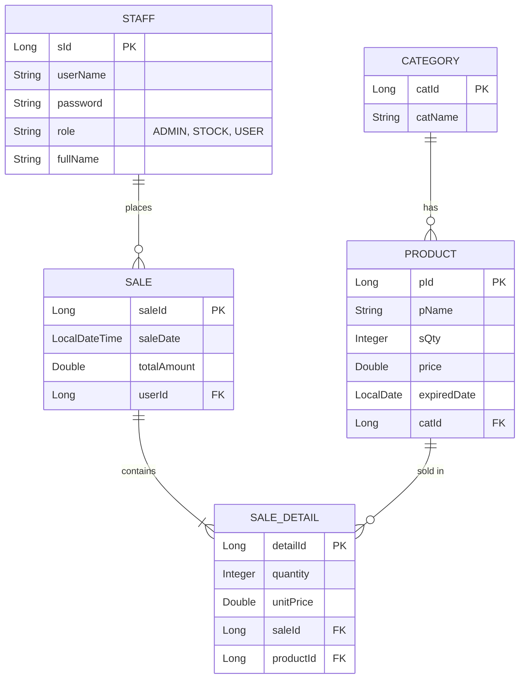
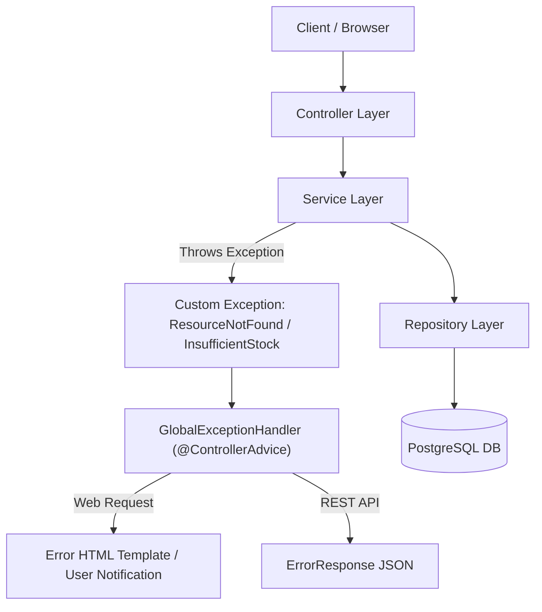

# Implementation Plan - Spring Boot E-Commerce System

Comprehensive architectural and implementation plan for building a Spring Boot application based on `all_lesson.md` guidelines, role-based capabilities (Admin, Stock, User), PostgreSQL database integration, and **Global Exception Handling**.

## Recommendations & Key Enhancements

> [!TIP]
> **Recommended Architectural Additions**:
> 1. **Sale & SaleDetail Entities**: To support **"User: Buy Product"** and **"Admin: Top sale category"**, we add `Sale` and `SaleDetail` tables. This allows users to place orders, decreases stock quantity (`SQty`) safely, and enables dynamic JPA analytical queries to compute top-selling categories.
> 2. **Global Exception Handling Layer (`exception` package)**: Adds uniform error handling across the application using `@ControllerAdvice` / `@RestControllerAdvice`, custom business exceptions (`ResourceNotFoundException`, `InsufficientStockException`, `UnauthorizedAccessException`), and friendly error templates/JSON responses.

> [!NOTE]
> **Database & Port Configuration**:
> - Port: **`3000`** (as per project rules)
> - Database: **PostgreSQL 18** (`jdbc:postgresql://localhost:5432/E-bookstrore_db`, password: `123`)

---

## Database & Entity Architecture



---

## System Architecture & Exception Flow



---

## User Review Required

> [!IMPORTANT]
> Please review the updated implementation details:
> 1. **Exception Package Structure**:
>    - Custom Exception classes (`ResourceNotFoundException`, `InsufficientStockException`, `UnauthorizedAccessException`).
>    - `GlobalExceptionHandler` with `@ExceptionHandler` to intercept exceptions globally and return customized HTTP responses (`404 Not Found`, `400 Bad Request`, `403 Forbidden`) or render error alert views in Thymeleaf.
> 2. **Staff Roles**:
>    - **ADMIN**: Full control, CRUD Staff, View Expired Products report, View Top-Selling Categories analytics.
>    - **STOCK**: CRUD Product & CRUD Category, view low-stock alerts.
>    - **USER**: Storefront UI, browse products, add to cart, and buy products (checkout).

---

## Proposed Changes

### 1. Configuration & Dependencies

#### [MODIFY] [pom.xml](file:///d:/Document/CODES%20DEV/SV2-Y3/JAVA%20Y4/SpringBoot_MidTerm/pom.xml)
- Add PostgreSQL driver dependency `org.postgresql:postgresql`.

#### [MODIFY] [application.properties](file:///d:/Document/CODES%20DEV/SV2-Y3/JAVA%20Y4/SpringBoot_MidTerm/src/main/resources/application.properties)
- Configure `server.port=3000`.
- Set PostgreSQL connection settings:
  ```properties
  server.port=3000
  spring.datasource.url=jdbc:postgresql://localhost:5432/E-bookstrore_db
  spring.datasource.username=postgres
  spring.datasource.password=123
  spring.datasource.driver-class-name=org.postgresql.Driver
  spring.jpa.hibernate.ddl-auto=update
  spring.jpa.show-sql=true
  spring.jpa.properties.hibernate.dialect=org.hibernate.dialect.PostgreSQLDialect
  ```

---

### 2. Domain Entities (Model Layer)

#### [NEW] `com.example.springboot_midterm.model.Staff`
- Fields: `sId` (PK), `userName`, `password`, `role` (`ADMIN`, `STOCK`, `USER`), `fullName`.

#### [NEW] `com.example.springboot_midterm.model.Category`
- Fields: `catId` (PK), `catName`.

#### [NEW] `com.example.springboot_midterm.model.Product`
- Fields: `pId` (PK), `pName`, `sQty`, `price`, `expiredDate`, `@ManyToOne Category category`.

#### [NEW] `com.example.springboot_midterm.model.Sale` & `SaleDetail`
- Transaction entities for tracking purchase orders and computing analytics.

---

### 3. Exception Handling Layer (`exception` package)

#### [NEW] `com.example.springboot_midterm.exception.ResourceNotFoundException`
- Custom RuntimeException thrown when a requested Product, Category, or Staff is not found by ID or username.

#### [NEW] `com.example.springboot_midterm.exception.InsufficientStockException`
- Custom RuntimeException thrown during checkout if requested product quantity exceeds available `sQty`.

#### [NEW] `com.example.springboot_midterm.exception.UnauthorizedAccessException`
- Custom RuntimeException thrown when a user attempts an action outside their allowed role (`ADMIN`, `STOCK`, `USER`).

#### [NEW] `com.example.springboot_midterm.exception.ErrorResponse`
- DTO containing `timestamp`, `status`, `error`, `message`, and `path` for REST responses.

#### [NEW] `com.example.springboot_midterm.exception.GlobalExceptionHandler`
- Uses `@ControllerAdvice` and `@RestControllerAdvice` to catch exceptions thrown from Controllers/Services and map them cleanly to HTTP status codes (`404`, `400`, `403`, `500`) or display Thymeleaf error pages (`error/404.html`, `error/generic.html`).

---

### 4. Repositories (Data Access Layer - JPA)

#### [NEW] `com.example.springboot_midterm.repository.StaffRepository`
- `findByUserName(String userName)`

#### [NEW] `com.example.springboot_midterm.repository.CategoryRepository`
- Standard JPA CRUD.

#### [NEW] `com.example.springboot_midterm.repository.ProductRepository`
- `findByExpiredDateBefore(LocalDate date)` to find expired products.
- `findByExpiredDateAfterAndSQtyGreaterThan(LocalDate date, Integer minQty)` for active available products.

#### [NEW] `com.example.springboot_midterm.repository.SaleDetailRepository`
- Custom JPQL query for **Top Sale Category**:
  `SELECT c.catName, SUM(sd.quantity) FROM SaleDetail sd JOIN sd.product p JOIN p.category c GROUP BY c.catName ORDER BY SUM(sd.quantity) DESC`

---

### 5. Service Layer (Business Logic)

#### [NEW] `com.example.springboot_midterm.service.StaffService`
- Staff login validation, password handling, admin CRUD logic. Throws `ResourceNotFoundException` if staff isn't found.

#### [NEW] `com.example.springboot_midterm.service.ProductService`
- Product CRUD, expired products filter. Throws `ResourceNotFoundException` if product isn't found.

#### [NEW] `com.example.springboot_midterm.service.CategoryService`
- Category CRUD management. Throws `ResourceNotFoundException` if category isn't found.

#### [NEW] `com.example.springboot_midterm.service.SaleService`
- Process purchase order, check stock availability (throws `InsufficientStockException` if quantity insufficient), decrease `sQty`, record sale, generate analytics.

---

### 6. Controller & Security Layer

#### [NEW] `com.example.springboot_midterm.controller.AuthController`
- `/login`, `/logout` endpoints, handles login redirection based on role (`ADMIN` -> `/admin`, `STOCK` -> `/stock`, `USER` -> `/shop`).

#### [NEW] `com.example.springboot_midterm.controller.AdminController`
- `/admin/staff` (CRUD Staff)
- `/admin/expired-products` (Expired Products list)
- `/admin/top-categories` (Top sale category report)

#### [NEW] `com.example.springboot_midterm.controller.StockController`
- `/stock/products` (CRUD Products)
- `/stock/categories` (CRUD Categories)

#### [NEW] `com.example.springboot_midterm.controller.UserController`
- `/shop` (Product catalog for user)
- `/shop/buy` (Buy product action, update `SQty`, record sale)

#### [NEW] Security Interceptor / WebConfig
- `AuthInterceptor` to prevent unauthorized role access (throws `UnauthorizedAccessException`).

---

### 7. View Layer (Thymeleaf Templates & Styling)

#### [NEW] UI Views in `src/main/resources/templates/`
- `login.html`: Modern login screen with role quick-fill demo buttons.
- `admin/dashboard.html`, `admin/staff-list.html`, `admin/staff-form.html`, `admin/reports.html`
- `stock/dashboard.html`, `stock/product-list.html`, `stock/product-form.html`, `stock/category-list.html`
- `user/shop.html`, `user/cart.html`, `user/receipt.html`
- `error/404.html`, `error/error.html`: Custom Thymeleaf exception error pages.

#### [NEW] `src/main/resources/static/css/style.css`
- Modern design system with alert banners for exceptions, badges for expired items & low stock warnings.

---

## Verification Plan

### Automated Verification
- Run `mvn clean compile` to ensure Java classes, dependencies, and exception handlers build cleanly.
- Run `mvn spring-boot:run` to verify database connection and schema initialization.

### Manual & Visual Verification
- Start application on `http://localhost:3000`.
- Verify database creation in PostgreSQL 18.
- Test **Exception Handling**:
  - Access non-existent product ID (verify `ResourceNotFoundException` rendering 404 error page).
  - Attempt to buy product quantity higher than `sQty` (verify `InsufficientStockException` error alert).
  - Attempt accessing `/admin` as a `USER` (verify `UnauthorizedAccessException` error page).
- Test **Admin, Stock, and User flows**.
